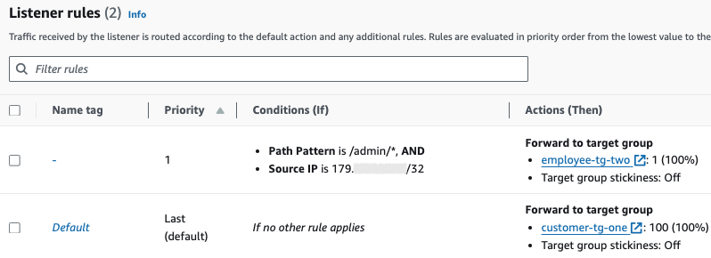

# Pasos

A continuación se presenta una descripción a alto nivel de los pasos efectuados durante el laboratorio, exhibiendo algunas capturas de pantalla con fines ilustrativos. No se lo hace en la secuencia propuesta en las instrucciones del mismo, sino agrupándolos como se considera más conveniente y resaltando algunos detalles que se estiman especialmente relevantes para entender el funicionamiento de la arquitectura propuesta.

### 1. Creación del entorno

**a.** En primer lugar, se crea un entorno en el servicio ***AWS Cloud9*** que levanta una instancia de EC2, donde se utilizará el IDE durante el desarrollo y se ejecutarán contenedores para evaluar las imágenes antes de enviarlas a producción. Como detalles a tener en cuenta, nótese que:
- La AMI elegida (*Amazon Linux 2*) incluye la *AWS CLI* que se utilizará para crear programáticamente algunos recursos. y también el engine de *Docker,* necesario precisamente para efectuar esas pruebas.
- La instancia se crea en la misma ***Amazon VPC*** (*LabVPC*) en que se está ejecutando originalmente la aplicación, lo cual hace posible conectarse con todo el resto de los recursos a utilizar.
- A su vez, dentro de esa VPC, la instancia está dentro de la subred *Public Subnet 1*; junto con otras, esa es una condición necesaria para que la instancia sea accesible desde internet, algo requerido para esar Docker durante el desarrollo (ver más adelante).

<figure>
  
  

  
  

  <figcaption> 
  <i>Entorno de AWS Cloud9 en la consola de AWS y su IDE.</i>
</figcaption>
</figure>

 

<figure>
  
  

  <figcaption> 
  <i>Detalle de la instancia EC2 que el servicio de Cloud9 levanta por detrás. Nótese la VPC y la subnet, dirección IP pública asignada y la AMI con Linux.</i>
</figcaption>
</figure>

 

**b.** Además, se crean dos repositorios en el servicio ***AWS CodeCommit***, uno para hostear el codebase de la aplicación y el otro para el código relacionado al deployment. Obsérvese que ambos se encuentran incluidos como directorios en este repositorio.

**c.** Asimismo, se crean dos *registries* de imágenes de contenedores en el servicio ***AWS ECR*** con el objetivo de alojar, en cada uno, las distintas versiones de las imágenes de los dos microservicios a crear.

<figure>
    <table cellspacing="100" cellpadding="100">
    <tr>
    <td>  </a> </td>
    <td>  </a> </td>
    </tr>
    </table>
    <figcaption> 
  <i>Repositorios de código en CodeCommit y de imágenes en ECR (registries).</i>
</figcaption>
</figure>

 

### 2. Migración a microservicios

**a.** Con el objetivo de pasar a ejecutar dos microservicios, uno para cada tipo de usuario (*customer* y *employee*), que puedan correr de forma independiente en contenedores, se modifica el código de la aplicación *monolítica* original. Para ello se generan dos copias análogas pero con las diferencias correspondientes a lo requerido para cada tipo de usuario.

**b.** Para evaluar durante el desarrollo y solucionar problemas de forma temprana, antes de enviar las nuevas versiones de las imágeneas a producción se las ejecuta en Docker. Para ello, para cada microservicio se crea el Dockerfile, se constrye la imagen y se levanta un contenedor con ella. Como se dijo, los contenedores deben ser públicamente accesibles de modo que las imágenes que corren puedan ser evaluadas via intenet usnado un navegador. Para ello:
- A la hora de ejecutar el contenedor se lo hace con un mapeo del puerto de la instancia de desarrollo (aquí el Docker host) al puerto correspondiente del contenedor (aquí 8080 u 8081), donde la aplicación está escuchando.
- A su vez, debe habilitarse el tráfico TCP en tales puertos en el security group asociado a la instancia de desarrollo de modo que la misma pueda recibir ese tráfico. 

Cumplidas ambas condiciones, con un navegador desde internet se puede acceder al servicio ejecutándose en el contenedor a través de los puertos 8080 / 8081 de la instancia de desarrollo.

**c.** Una vez completado el desarrollo deseado, para cada microservicio, se hace un *push* de la imagen al registry correspndiente creado en ECR en el paso previo.

<figure>
  
  

  <figcaption> 
  <i>Captura de pentalla del IDE. Obsérvense los directorios con el código para cada microservicio, los dockerfiles (uno abierto) y una terminal mostrando el docker engine y la AWS CLI instalados, las imágenes de docker creadas y los contenedores corriendo con las misma.s</i>
</figcaption>
</figure>

 

### 3. Creación del Application Load Balancer

**a.** Hecho eso, se crea un Application Load Balancer (ALB) de tipo *internet-facing* en *LabVPC*. Como detalles a tener en cuenta, nótese que:
- Se lo asocia a las dos subredes públicas (*Public Subnet 1* y *Public Subnet 2*), lo cual es necesario para que reciba tráfico de internet y pueda enviarlo a los contenedores de ECS que correrán en esas subredes.
- Se le asigna un security group en el que se crean reglas de entrada que permiten el tráfico TCP desde cualquier IPv4 en los puertos 80 y 8080, que son los que se usaran para la aplicación.

<figure>
  
  

  <figcaption> 
  <i>Detalle del Application Load Balancer. Nótense la VPC, las subnets asociadas y el security group.</i>
</figcaption>
</figure>

 

**b.** Dado que se pretende utilizar la estrategia de deployment *blue/green* que implica que, ante un deployment, pasaremos de usar la aplicación del entorno *blue* (con la versión en uso) al entorno *green* (con la nueva versión) de modo de garantizar su disponibilidad en todo momento, se tiene que:
  - Para cada microservicio se requieren dos *target groups (TG)*, por lo cual se crean los cuatro TG necesarios.
  - Se requieren dos *listeners* (en 80 y 8080, que son los puertos a utilizar). A su vez, para enrutar el tráfico al microservicio correspondiente, cada uno de ellos debe tener dos *rules* (que a su vez envian a cada uno de esos TG):
    - Una regla default que enviará tráfico al microservico ***customer***.
    - Una regla específica que enviará el tráfico que incluya `/admin` en el path al microservico ***employee***.  

<figure>
    <table cellspacing="100" cellpadding="100">
    <tr>
    <td>   </td>
    <td>  </td>
    </tr>
    </table>
    <figcaption> 
  <i>Los cuatro target groups creados y los dos listeners del ALB.</i>
</figcaption>
</figure>

 

<figure>
    <table cellspacing="100" cellpadding="100">
    <tr>
    <td>   </td>
    <td>  </td>
    </tr>
    </table>
    <figcaption> 
  <i>Detalle de las rules para los listener 80 (izquierda) y 8080 (derecha).</i>
</figcaption>
</figure>

 

### 4. Creación del ECS cluster

**a.** Utilizando el servicio **AWS ECS** y empleando **AWS Fargate** como compute engine, se crea un cluster *serverless* 
(*microservices-serverlesscluster*) dentro de la *LabVPC* y configurado para usar *Public Subnet 1* y *Public Subnet 2*, que se utilizará para ejecutar los microservicios.

**b.** Para cada microservicio se crea la *task definition*, que funcionará como "molde" a la hora de instanciar nuevas *tasks* de acuerdo a la escala requerida; a su vez se registra en ECS utilizando el comando `aws ecs register-task-definition` de la AWS CLI. Como detalle, obsérvese que se deja parametrizado el nombre de la imagen para que durante el deployment se interpole con la versión adecuada.

**c.** Se crean los dos *ECS services*, especificando detalles como el cluster donde correrá, la task definition para crear las tasks, los puertos a exponer por el contenedor, el target group y una `desired-count` inicial de 1, lo cual implica que al iniciar el servicio se ejecute una única réplica. Se lo hace utilizando el comando `aws ecs create-service` de la AWS CLI.

<figure>
  
  

  
  

  <figcaption> 
  <i>Task definitions de los dos microservicios y detalle del cluster de ECS con sus servicios. Nótese como ambos servicios ejecutarán una task cada uno (el employee todavía levantando el container).</i>
</figcaption>
</figure>

 

### 5. Incorporación de prácticas de CI/CD

**a.** Se crea una "applicación" del servicio **AWS Code Deploy** con un *deployment group* para cada servicio, indicando en cada caso los TG correspondientes y el ECS service a donde se debe hacer el deployment.

**b.** Para cada microservicio se crea el *application specification (AppSpec) file* donde se establece cómo efectuar el deploy. Como con la task definition, se deja paramerizado el value de la task definition para que pueda ser evaluado dinámicamente al momento del deployment.

<figure>
  
  

  
  

  <figcaption> 
  <i>AppSpec files en el IDE de Cloud9 y CodeDeploy application con sus depoyment groups.</i>
</figcaption>
</figure>

 

**c.** Con el servicio **AWS CodePipeline**, para cada microservicio se crea un pipeline en el que se establecen las sources de los artifacts y ECS como compute para las tareas asociadas al deployment. En particular, se especifican dos sources: CodeCommit, que proveerá un primer *input artifact* conteniendo la task definition del microservicio y el correspondiente appspec file, y ECR, que proveerá un segundo input artifact que incluye la imagen que deben correr las tasks. Ambas source actions tienen *change detection* automatizado por lo que, aún cuando no se especifiquen *triggers*, el pipeline se iniciará ante cambios en cualquiera de ellas. 

<figure>
    <table cellspacing="100" cellpadding="100">
    <tr>
    <td>   </td>
    <td>  </td>
    </tr>
    </table>
    <figcaption> 
  <i>Detalle de los pipelines para cada microservicio. Obsérvense las dos sources en cada uno: el código de CodeCommit y la imagen de ECR.</i>
</figcaption>
</figure>

 

**d.** Finalmente se examina el funcionamiento del deployment, desencadenando los pipelines manualmente y verificando los cambios en la configuración del ALB (en los listeners y en las vinculaciones de los TG) consistentes con la estrategia de depoyment blue/green en uso. 

<figure>
  
  

  <figcaption> 
  <i>Detalle de ambos pipelines con su ejecución (manual) exitosa.</i>
</figcaption>
</figure>

 

### 6. Evaluación de situaciones de uso real

**a.** Se evalúa la posibilidad de gestionar las listener rules y con ellas el ruteo y acceso a los microservicios. En particular, se limita el acceso a un solo IP para el microservicio ***employee*** utilizando una listener rule más restrictiva y se verifica que el microservicio queda inaccesible para otras direcciones IP.

<figure>
    <table cellspacing="100" cellpadding="100">
    <tr>
    <td>   </td>
    <td>  </td>
    </tr>
    </table>
    <figcaption> 
  <i>Detalle de la listener rule actualizada para cada servicio, incluyendo una dirección IP pública particular (oculta parcialmente) para el caso del microservicio employee.</i>
</figcaption>
</figure>

 

**b.** Se ensaya la situación diaria de desarrollo en la que se modifica el código, se "rebuildea" la imagen y se hace un "push" al registry de ECR. Como es esperable, eso dispara de forma automatizada una ejecución del pipeline correspondiente a ese microservicio que resulta en un deployment con los cambios introducidos sin afectación de la disponibilidad del servicio en producción.

<figure>
  
  

  <figcaption> 
  <i>Deployment iniciado automáticamente al hacer "un push" registry de ECR con la nueva versión de la imagen. Nótese cómo, tal como es esperable en un blue/green deployment, la replacement task pasa a servir la totalidad del tráfico.</i>
</figcaption>
</figure>

 

**c.** También se experimenta el escalado de un servicio de forma independiente del otro, en este caso de forma manual.
- Para ello, primero se utiliza el comando `aws ecs update-service` de la AWS CLI indicando el cluster y servicio correspondiente, y selecionando un valor para el parámetro `desired-count` de 3, mayor al valor 1 seteado inicialmente al registrar el servicio. Inmediatamete ECS comienza a provisionar las task necesarias para llegar al número elegido y luego de unos minutos están totalmente operativas en estado *running*.

<figure>
  
  

  
  

  
  

  <figcaption> 
  <i>Escalado de microservicio customer. Se observa primero el despliegue de las nuevas tasks para alcanzar el número de 3 deseado y finalmente, concluido el mismo ya todas funcionando.</i>
</figcaption>
</figure>

 

- Luego, de forma inversa, se hace un *scale in*; se disminuye el numero de replicas deseadas y las excedentes inician un proceso de desactivación que luego de unos minutos las lleva al estado *stopped*.
- Finalmente, definiendo el valor 0 para el parámetro `desired-count`, se detienen todas las tasks del servicio.

<figure>
  
  

  <figcaption> 
  <i>Detención de ambos microservicios, com ambos sin tasks en ejecución.</i>
</figcaption>
</figure>

 

[Volver al README](../README.md)